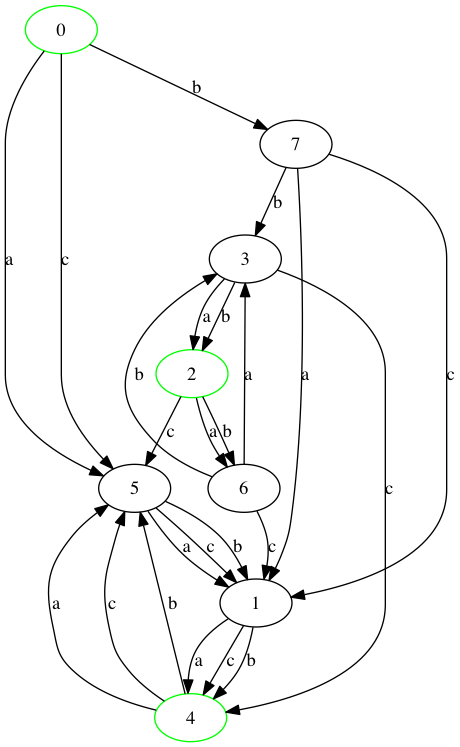

### Generate examples from `parsimonious` grammars
References:
- [Issue to implement in `revex`](https://github.com/lucaswiman/revex/issues/5)
- ["Detecting Ambiguity in Programming Language Grammars"](http://soft-dev.org/pubs/pdf/vasudevan_tratt__detecting_ambiguity_in_programming_language_grammars.pdf).
  Describes using Boltzmann samplers on programming language grammars, then doing a sort of "mutation testing" of the grammars.
- ["A CALCULUS FOR THE RANDOM GENERATION OF COMBINATORIAL STRUCTURES"](http://algo.inria.fr/flajolet/Publications/RR-1830.pdf) Describes a way of constructing combinatorial objects via a "grammar" of simpler combinatorial objects.
- ["Boltzmann Samplers for the Random Generation of Combinatorial Structures"](http://algo.inria.fr/flajolet/Publications/DuFlLoSc04.pdf) A more efficient way of sampling from the above constructions using Boltzmann distributions.

### Python 3 import checker
- flake8-tidy-imports
- Comprehensive list of removed/moved imports https://github.com/lucaswiman/legacy-python-upgrade-guide/blob/master/imports/build_banned_imports.py


### Railroad diagrams for `parsimonious`

Issue: https://github.com/erikrose/parsimonious/issues/104

PRs:
- https://github.com/erikrose/parsimonious/pull/108
- https://github.com/tabatkins/railroad-diagrams/pull/44


### Bug with CheckBoxSelectMultiple

https://github.com/django-crispy-forms/django-crispy-forms/issues/690


### Expand this wiki page stub to include literature review from building revex

https://en.wikipedia.org/wiki/String_generation


### Update revex to use matrix multiplication for computing path counts
Given a multi-digraph, you can compute the adjacency matrix, where  is degree between vertices i and j, then  is the number of walks from i to j of length n. This should be much more computationally efficient than what we're doing (both because linear algebra software is quite fast, and be cause it can use efficient algorithms for the power). One issue is the renormalization that takes place to prevent arithmetic overflow. I haven't found a good way of avoiding by normalizing the initial matrix. I think this would also make the "divide and conquer" algorithm from the Bernardi & Giménez paper
```
>>> dfa = construct_integer_dfa((compile(r'[abc]*|bb[ab]*') & compile(r'(.{3})*')).as_dfa('abc'))
>>> dfa._draw(full=True)
>>> matrix = nx.to_numpy_matrix(dfa)
>>> matrix
matrix([[ 0.,  0.,  0.,  0.,  0.,  2.,  0.,  1.],
        [ 0.,  0.,  0.,  0.,  3.,  0.,  0.,  0.],
        [ 0.,  0.,  0.,  0.,  0.,  1.,  2.,  0.],
        [ 0.,  0.,  2.,  0.,  1.,  0.,  0.,  0.],
        [ 0.,  0.,  0.,  0.,  0.,  3.,  0.,  0.],
        [ 0.,  3.,  0.,  0.,  0.,  0.,  0.,  0.],
        [ 0.,  1.,  0.,  2.,  0.,  0.,  0.,  0.],
        [ 0.,  2.,  0.,  1.,  0.,  0.,  0.,  0.]])
>>> matrix ** 5
matrix([[   0.,  235.,    0.,    8.,    0.,    0.,    0.,    0.],
        [   0.,    0.,    0.,    0.,    0.,  243.,    0.,    0.],
        [   0.,  211.,    0.,   32.,    0.,    0.,    0.,    0.],
        [   0.,    0.,    0.,    0.,    0.,  211.,   32.,    0.],
        [   0.,  243.,    0.,    0.,    0.,    0.,    0.,    0.],
        [   0.,    0.,    0.,    0.,  243.,    0.,    0.,    0.],
        [   0.,    0.,   32.,    0.,  211.,    0.,    0.,    0.],
        [   0.,    0.,   16.,    0.,  227.,    0.,    0.,    0.]])

```



### import formatter command for flake8-import-order

This has several import styles, but no way to automatically put imports in the right place. https://github.com/PyCQA/flake8-import-order